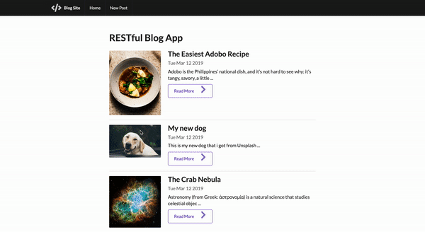

# A Modern Blog App

A modern UI web app to write, edit, update and delete blog posts.

## What I Learnt

* Configuring a Google Cloud Platform Compute Engine to deploy a MEAN stack app
*  SemanticUI framework for design purposes
* Using express with npm packages to deploy a Node.JS app
* Prevent attempts to attack website using a sanitizer to clean code before user can enter it in to system
* Build data presistence with mongoDB
* The 7 RESTful Routes (Index: GET, New: GET, Create: POST, Show: GET, Edit: GET, Update: PUT, Destroy: DELETE)

